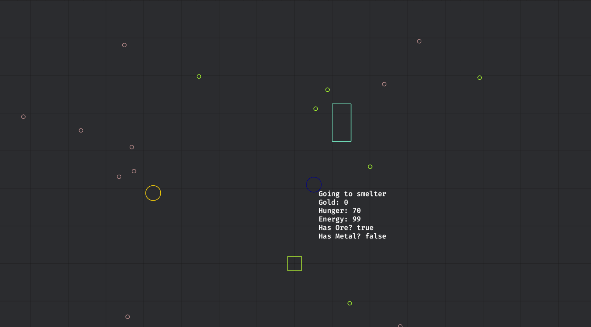

# Data-Oriented GOAP (Goal-Oriented Action Planning)
[](https://github.com/victorb/dogoap#License)
[](https://crates.io/crates/dogoap)
[](https://crates.io/crates/dogoap)
[](https://docs.rs/dogoap/latest/dogoap/)
[](https://github.com/victorb/dogoap/actions/workflows/ci.yml)

> AKA DOGOAP - GOAP implemented in data-oriented way to facilitate dynamically setting up states/actions/goals rather than only at compile-time

> Includes bevy_dogoap which provides a neat Bevy integration of the dogoap library

### [Live Demos](https://victorb.github.io/dogoap)

[](https://victorb.github.io/dogoap)

## Documentation

- [`dogoap`](./crates/dogoap/README.md) docs - Standalone library for creation actions, states and goals to be used with the provided planner
- [`bevy_dogoap`](./crates/bevy_dogoap/README.md) docs - Integration of the `dogoap` library into Bevy

## Why should I use this?

- If you have NPCs that have to perform tasks that depend on each other (Move to A > pickup item X > move to B > drop item X), GOAP can help you do that
- If you want NPCs to be able to improvise themselves to how to reach a goal (aka "emergent behaviour"), after you setup the actions, GOAP can help you do that
- You're looking for something more involved than Utility AI, but you don't wanna go full HTNs, GOAP can help you do that
- You watched the F.E.A.R GDC talk (or the Shadow of Mordor one) from some Monolith people, and you know you want GOAP, then this library helps you skip the boring stuff :)

## Minimal Bevy Example

In this example, we create a IsHungry `DatumComponent` that signals if the entity is hungry or not, and a EatAction `ActionComponent`.

```rust
#[derive(Component, Reflect, Clone, DatumComponent)]
struct IsHungry(bool);

#[derive(Component, Reflect, Clone, Default, ActionComponent)]
struct EatAction;

fn setup(mut commands: Commands) {
    // We want our final outcome to be that IsHungry is set to false
    let goal = Goal::from_reqs(&[IsHungry::is(false)]);

    // Here we declare that the result of perfoming EatAction is that IsHungry gets set to false
    let eat_action = EatAction::new().add_mutator(IsHungry::set(false));

    // Creating the planner with everything together gives us Components we can use with Bevy
    let (planner, components) = create_planner!({
        actions: [(EatAction, eat_action)],
        state: [IsHungry(true)],
        goals: [goal],
    });

    // Add `planner` + `components` to your Entity, or spawn a new one
    commands.spawn((Name::new("Planner"), planner, components));
}

// System for handling EatAction
fn handle_eat_action(
    mut commands: Commands,
    mut query: Query<(Entity, &EatAction, &mut IsHungry)>,
) {
    for (entity, _eat_action, mut is_hungry) in query.iter_mut() {
        is_hungry.0 = false;
        commands.entity(entity).remove::<EatAction>();
    }
}
```

Once you run this code, the planner will automatically figure out that the entity needs to execute the EatAction in order to set IsHungry to false, and your defined System handles the actual logic of the action.

More involved examples can be found here: [bevy_dogoap examples](./crates/bevy_dogoap/README.md#More%20Examples)

## Prior Art / Other similar projects

- https://github.com/skyne98/soap - A lot of inspiration taken from this repository, biggest difference is the data-oriented structure that dogoap has + the tight Bevy integration dogoap offers
- https://github.com/dmackdev/bevy_goap - Native Bevy GOAP library, API interface isn't ideal though
- https://github.com/QueenOfSquiggles/bevy_htnp - Native Bevy HTN (Hierarchical Task Network) library

## License

MIT 2024 - Victor Bjelkholm
